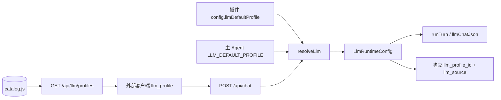

# 主应用完整开发方案

> **版本**：v1.3 · 2026-06-24  
> **运行模式**：**个人本地项目** — 无用户鉴权、仅 localhost 运行。  
> **项目范围**：**仅 `agent-management-master` 仓库** — Agent + BFF 服务层；不含前端。  
> **架构定位**：**主 Agent 多方案平台** + **轻量子 Agent（Skill 式插件）**；对齐 [`主应用开发设计.md`](./主应用开发设计.md)。  
> **外部参考**（不迁入、不迁移）：`fitness-agent`、`cartoon-agent` 仅作 Pi/BFF/LLM 等技术栈参考。  
> **依据**：
> - 架构设计：[`主应用开发设计.md`](./主应用开发设计.md)
> - Agent 方案文档：[`docs/schemes/`](../schemes/README.md)（pi / langchain / loop / react，各方案独立文件夹）
>
> **目标读者**：主 Agent 平台开发者、子 Agent（Skill）配置作者

---

## 1. 方案摘要

本仓库开发 **Egg.js 可插拔主 Agent 平台**：支持多种 **Agent 方案**（Pi、LangChain、Loop、ReAct…）可扩展注册；业务侧通过 **子 Agent Skill 插件**（配置 + 功能回调）接入，**不是**完整的独立 Agent 工程。

### 1.1 双层模型

```
┌─────────────────────────────────────────────────────────┐
│  主 Agent（agent-management-master · 本次唯一开发项目）      │
│  BFF · PluginManager · SchemeRegistry · RouteManager    │
│  MemoryEngine · resolveLlm · DB 自动化                     │
└───────────────────────────┬─────────────────────────────┘
                            │ 按 skill.scheme 分发
        ┌───────────────────┼───────────────────┐
        ▼                   ▼                   ▼
   schemes/pi        schemes/langchain    schemes/loop …
   （方案实现+文档）   （各方案独立文件夹）    （可继续扩展）
        ▲                   ▲
        │                   │
   plugins/weather-skill   plugins/note-skill
   scheme:'langchain'      scheme:'pi'
   （轻量：index.js + 回调）  （非 fitness/cartoon 级工程）
```

| 层级 | 是什么 | 不是什么 |
|------|--------|----------|
| **主 Agent** | 平台：生命周期、路由、方案注册、LLM、记忆、BFF | 具体业务 Agent |
| **Agent 方案** | 执行引擎：`pi` / `langchain` / `loop` / `react`…，各方案 **独立目录+文档** | 业务插件 |
| **子 Agent Skill** | 配置 + 路由 + 可选表 + **callbacks**；`index.js` 声明 `scheme` | fitness/cartoon 级完整 Agent 项目 |

### 1.2 项目边界

| 在本项目内 | 不在本项目内 |
|------------|--------------|
| Egg 主应用、SchemeRegistry、BFF | `fitness-agent` / `cartoon-agent` 整体迁移 |
| `app/lib/schemes/{scheme}/` 方案实现 | 前端 UI |
| `plugins/{skill}/` 轻量 Skill 插件 | 子 Agent 内嵌完整 Pipeline / 多角色工程 |
| `docs/schemes/{scheme}/` 方案文档 | 套壳鉴权（本地模式不启用） |
| REST / SSE 对外 API | |

**对外关系**：纯后端服务（如 `:3001`）；外部客户端经 API 调用；模型等交互态由调用方传入（如 `llm_profile`）。

| 维度 | 主 Agent（平台） | 子 Agent Skill |
|------|------------------|----------------|
| 职责 | 方案注册与调度、插件生命周期、路由、DB、记忆、LLM 解析 | 业务配置、路由声明、callbacks、可选 SKILL.md |
| 扩展方式 | 新增 `schemes/{name}/` + 注册 | 新增 `plugins/{skill}/` 目录 |
| 选用方案 | SchemeRegistry | `index.js` → **`scheme: 'pi' \| 'langchain' \| …`** |
| 模型 | 三级优先级：请求 > Skill 默认 > 平台 Ollama 默认 | `config.llmDefaultProfile`（P2） |

**核心价值**：主 Agent **一次建设、多方案并存**；新业务 **只加 Skill 目录 + 选 scheme**，无需复制整套 Agent 工程。

---

## 2. 架构总览

### 2.1 服务拓扑（Agent + BFF）

```
┌─────────────────────────────────────────────────────────────────┐
│  外部客户端（独立项目 · 不在本仓库）                                  │
│  例：Vue 创作台 / 健身 App / curl / Postman                        │
└────────────────────────────┬────────────────────────────────────┘
                             │ HTTP / SSE（localhost:3001）
                             │ body: llm_profile, message, ...
┌────────────────────────────▼────────────────────────────────────┐
│  agent-management-master（Egg.js · 本项目）                      │
│  ┌──────────────┐  ┌──────────────┐  ┌──────────────────────┐  │
│  │ PluginManager│  │SchemeRegistry│  │ RouteManager / Memory  │  │
│  └──────┬───────┘  └──────┬───────┘  └──────────┬───────────┘  │
│         │                 │ 按 scheme 选 Executor │              │
│  ┌──────▼─────────────────▼──────────────────────▼──────────┐  │
│  │ BFF + Executor（pi / langchain / loop / react / …）        │  │
│  └──────────────────────────┬───────────────────────────────┘  │
└─────────────────────────────┼──────────────────────────────────┘
                              │
         ┌────────────────────┼────────────────────┐
         ▼                    ▼                    ▼
   PostgreSQL          workspaces/         plugins/（Skill）
                              │
                    app/lib/schemes/（方案实现）
                    docs/schemes/（方案文档）
```

### 2.2 Agent 方案（Scheme）— 主 Agent 核心扩展点

每种方案 **独立文件夹**，实现 + 文档一一对应：

| scheme id | 代码目录 | 文档 |
|-----------|----------|------|
| `pi` | `app/lib/schemes/pi/` | [`docs/schemes/pi/README.md`](../schemes/pi/README.md) |
| `langchain` | `app/lib/schemes/langchain/` | [`docs/schemes/langchain/README.md`](../schemes/langchain/README.md) |
| `loop` | `app/lib/schemes/loop/` | [`docs/schemes/loop/README.md`](../schemes/loop/README.md) |
| `react` | `app/lib/schemes/react/` | [`docs/schemes/react/README.md`](../schemes/react/README.md) |

**新增方案步骤**（不改主应用业务代码）：

1. 在 `app/lib/schemes/{name}/` 实现 `XxxExecutor extends AgentExecutor`
2. 在 `docs/schemes/{name}/README.md` 编写方案说明
3. 在 `SchemeRegistry` 注册
4. Skill 插件 `scheme: '{name}'` 即可选用

统一执行入口（对齐设计文档 §4.1）：

```javascript
class AgentExecutor {
  static schemeId;
  constructor(skill) { this.skill = skill; }
  async executeTask(ctx, params) { throw new Error('必须实现'); }
  async setupMemory(config) { /* 可选 */ }
  async teardownMemory() { /* 可选 */ }
}
```

### 2.3 子 Agent Skill — 轻量插件

对齐设计文档「子项插件类似 Skill」：**不是** fitness/cartoon 那种含完整 BFF Pipeline、多角色 workspace 的工程。

| Skill 包含 | Skill 不包含 |
|------------|--------------|
| `index.js` 元数据（**含 `scheme`**） | 独立 `server/` 工程 |
| `routes`、可选 `dbTables` | 六站 turn_jobs 全套（除非平台统一提供） |
| `callbacks`（enrich / persist / format） | 多套 `workspace-templates/{role}/` |
| 可选 `SKILL.md`、`templates/` | 前端、独立部署单元 |

### 2.4 外部仓库（仅技术参考）

| 仓库 | 参考用途 | 本项目态度 |
|------|----------|------------|
| `fitness-agent` | Pi runTurn、BFF 模式、appSettings、记忆 | **只读参考**，不迁移 |
| `cartoon-agent` | llmProfiles、SSE、outbox 落库模式 | **只读参考**，不迁移 |

---

## 3. 技术选型（对齐设计文档 + 实践修正）

| 组件 | 选型 | 说明 |
|------|------|------|
| BFF / 主框架 | **Egg.js 3.x** | 插件机制、多进程、messenger |
| 语言 | **TypeScript / JavaScript** | 与参考项目一致 |
| 数据库 | **PostgreSQL** | 插件元数据、Skill 业务表 |
| ORM | **Sequelize** | Skill `dbTables` 动态 sync |
| Agent 方案 | **SchemeRegistry + 多 Executor** | pi 优先；langchain / loop / react 渐进 |
| Pi 运行时 | **@earendil-works/pi-agent-core** | 仅 `scheme: pi` 的 Skill 使用 |
| LangChain | **langchain**（Phase 3） | 仅 `scheme: langchain` 的 Skill 使用 |
| 沙箱 | **vm2**（可选） | `riskLevel: high` 的 Skill |
| 审计 | **egg-winston** + `audit_logs` | |
| 配置 | **`appSettings.ts`** | env 唯一入口（参考 fitness） |

> **不含**：前端；fitness/cartoon 整体代码迁移。

---

## 4. 主应用目录结构

```
agent-management-master/
├── app/
│   ├── controller/
│   │   ├── plugin.js          # Skill 插件 CRUD / 启停
│   │   ├── llm.js             # GET /api/llm/profiles
│   │   ├── health.js
│   │   └── skill.js           # 统一 Skill 调用入口（按路由分发）
│   ├── service/
│   │   ├── pluginManager.js   # 扫描 plugins/、生命周期
│   │   ├── schemeRegistry.js  # ★ 方案注册与 get(schemeId)
│   │   ├── routeManager.js
│   │   ├── dbManager.js
│   │   └── memoryEngine.js
│   ├── middleware/
│   │   ├── pluginAudit.js
│   │   └── pluginMetrics.js
│   ├── model/
│   └── extend/
│       └── application.js
├── app/lib/
│   ├── schemes/               # ★ Agent 方案（每种方案独立文件夹）
│   │   ├── registry.js
│   │   ├── base/
│   │   │   └── executor.js    # AgentExecutor 基类
│   │   ├── pi/
│   │   ├── langchain/
│   │   ├── loop/
│   │   └── react/
│   ├── llm/
│   │   ├── catalog.js
│   │   └── resolveLlm.js
│   └── framework.js           # CustomLoader
├── plugins/                   # ★ 子 Agent Skill（轻量）
│   ├── weather-skill/         # 示例：scheme: langchain
│   └── note-skill/            # 示例：scheme: pi
├── config/
├── agent.js
├── app.js
├── database/
├── docs/
│   ├── schemes/               # ★ 方案文档（与 app/lib/schemes 对应）
│   │   ├── README.md
│   │   ├── pi/
│   │   ├── langchain/
│   │   ├── loop/
│   │   └── react/
│   └── api/                   # 对外 REST/SSE 契约
├── docs-design/
│   ├── 主应用开发设计.md
│   └── 主应用完整开发方案.md
└── package.json
```

---

## 5. 子 Agent Skill 契约（轻量插件）

> 对齐设计文档 §3：子项插件 **类似 Skill** — 配置 + 回调，非完整 Agent 工程。  
> 字段 `scheme`（或兼容旧名 `agentType`）声明使用的 **Agent 方案**。

### 5.1 Skill 目录结构（推荐 · 最小）

```
plugins/{skill-name}/
├── index.js          # ★ 元数据 + callbacks（必须）
├── SKILL.md          # 可选：业务说明 / Pi 契约
├── templates/        # 可选：prompt 模板
├── tools/            # 可选：scheme=pi 时的 *.mjs
└── db/
    └── init.sql      # 可选：dbTables 对应 schema
```

**不需要**：独立 `server/`、`workspace-templates/{多角色}/`、完整 BFF Pipeline 目录（除非 Skill 确有特殊需求且经评审）。

### 5.2 index.js Schema

```javascript
module.exports = {
  name: 'weather-skill',
  version: '1.0.0',
  description: '城市天气查询',
  scheme: 'langchain',              // ★ 选用 Agent 方案（见 docs/schemes/）
  riskLevel: 'normal',
  routes: [{
    path: '/api/skills/weather',
    method: 'GET',
    description: '查询城市天气',
    parameters: {
      type: 'object',
      properties: { city: { type: 'string' } },
      required: ['city'],
    },
    requiresAuth: false,
    memoryAccess: null,
  }],
  dbTables: ['weather_history'],
  memoryConfig: {
    enabled: false,
  },
  config: {
    llmDefaultProfile: 'ollama-qwen',  // P2 模型
    // 方案相关配置，见各 scheme 文档
    chain: { type: 'tool-agent', tools: ['getWeather'] },
  },
  callbacks: {
    /** 执行前：补充上下文 / 校验入参 */
    async beforeExecute(ctx, params) {
      return params;
    },
    /** scheme=pi：拼 inbox；scheme=langchain：拼 chain input */
    async enrichContext(ctx, params) {
      return { input: params };
    },
    /** 执行后：格式化 HTTP / SSE 响应 */
    async formatResponse(ctx, result) {
      return { reply: result.text, data: result.output };
    },
    /** 持久化：写 dbTables / 记忆 */
    async persistResult(ctx, result) {
      // 可选
    },
    /** 插件 enable / disable 生命周期 */
    async onEnable(app) {},
    async onDisable(app) {},
  },
};
```

### 5.3 scheme 与 Executor 分工

| 谁 | 做什么 |
|----|--------|
| **Skill** | 声明 `scheme`、路由、表、config、**callbacks** |
| **Scheme Executor** | 按方案运行 LLM/Chain/Loop/ReAct |
| **主 Agent BFF** | 路由、resolveLlm、调 callbacks、DB 迁移、SSE |

### 5.4 各 scheme 下 Skill 可选附件

| scheme | Skill 可附带 | 参考文档 |
|--------|--------------|----------|
| `pi` | `SKILL.md`、`tools/*.mjs`、`templates/` | [pi/README](../schemes/pi/README.md) |
| `langchain` | `config.chain`、`callbacks.buildInput` | [langchain/README](../schemes/langchain/README.md) |
| `loop` | `config.loop`、`callbacks.onStep` | [loop/README](../schemes/loop/README.md) |
| `react` | `config.react`、`callbacks.formatAnswer` | [react/README](../schemes/react/README.md) |

### 5.5 与设计文档字段对照

| 设计文档 `index.js` | 本方案 |
|---------------------|--------|
| `agentType: 'langchain'` | **`scheme: 'langchain'`**（推荐） |
| `routes` / `dbTables` / `memoryConfig` | 不变 |
| 无 callbacks | **新增**：Skill 业务钩子，避免 Skill 膨胀为独立工程 |

### 5.6 反模式（禁止）

- 在 Skill 内复制 fitness/cartoon 全套 `bff/` + `agent/` 目录
- 在 Skill 内硬编码 `scheme` 分支的大段 TS 编排（应扩展 **新 scheme** 或收紧 callbacks）
- BFF 用关键词替 Skill 做意图路由
- Skill 直接读 env 中的 apiKey（必须走主 Agent `resolveLlm`）

---

## 6. 请求处理流水线（平台统一 · 轻量）

主 Agent 对 **所有 Skill** 使用统一编排，不按 fitness/cartoon 复制多套 Pipeline：

```
HTTP 请求
  → RouteManager 匹配 Skill 路由
  → resolveLlm（P1 入参 > P2 Skill > P3 平台 Ollama）
  → Skill.callbacks.beforeExecute / enrichContext
  → SchemeRegistry.get(skill.scheme).executeTask(ctx, params)
  → Skill.callbacks.formatResponse / persistResult
  → JSON 或 SSE 响应
```

| 步骤 | 模块 | 说明 |
|------|------|------|
| 路由 | `routeManager` | 动态挂载 `/api/skills/*` 或 Skill 自定义 path |
| 模型 | `resolveLlm` | 见 §10A |
| 执行 | `schemes/{scheme}/` | 各方案 Executor |
| 回调 | `skill.callbacks` | 业务格式化与落库 |
| 流式 | `skillInvoke` + SSE | 可选；Pi scheme 支持 delta |

**async 队列**（turn_jobs）：作为 **平台可选能力** Phase 4+ 实现，非 Skill 必备；本地默认同步。

### 6.1 Pi scheme 补充（参考 fitness/cartoon）

当 `scheme: 'pi'` 时，Executor 内部可参考 fitness/cartoon 的 inbox/outbox 模式；逻辑仍封装在 **`app/lib/schemes/pi/`**，不下沉到 Skill 目录。

---

## 6A. 对外 API 接入契约（供独立前端项目）

> 本节定义 **Agent + BFF 对外暴露** 的接口边界。前端/UI 不在本仓库实现，联调时以本文 + OpenAPI 为准。

### 6A.1 通用约定

| 项 | 约定 |
|----|------|
| 基址 | `http://localhost:{PORT}`，默认 `3001` |
| 内容类型 | JSON 请求；聊天回传 **SSE**（`text/event-stream`） |
| 鉴权 | 本地模式 **无**；独立前端若需登录，在客户端或网关层自行实现 |
| CORS | `config.corsOrigin` 可配置允许来源（供浏览器端独立前端联调） |
| 幂等 | async 模式必传 `client_turn_id`（UUID） |

### 6A.2 平台级 API

| 方法 | 路径 | 说明 |
|------|------|------|
| GET | `/health` | 存活探针 |
| GET | `/ready` | 就绪探针（DB 连通） |
| GET | `/api/llm/profiles` | 模型 catalog + 默认 profile |
| GET | `/api/plugins` | 已加载插件列表与状态 |

### 6A.3 Skill API（动态注册）

路由由 Skill 的 `routes[]` 声明，`RouteManager` 挂载。示例：

| 方法 | 路径 | Skill | scheme |
|------|------|-------|--------|
| GET | `/api/skills/weather` | weather-skill | langchain |
| POST | `/api/skills/note/chat` | note-skill | pi |

聊天类 Skill 可在 body 中传 `llm_profile`（P1）、`session_id`、`message` 等，见 §6A.4。

### 6A.4 聊天请求体（通用字段）

```typescript
interface ChatRequestBody {
  session_id: string;
  message: string;
  llm_profile?: string;        // P1 模型选择
  client_turn_id?: string;     // async 幂等
  // 插件扩展字段见各插件 AGENTS.md / docs/
}
```

### 6A.5 SSE 事件（通用）

| event | 说明 |
|-------|------|
| `status` | 阶段进度（`phase`, `label`） |
| `delta` | 流式文本片段 |
| `message` | 最终载荷（含 `reply`, `message_type`, `llm_profile_id`） |
| `done` | 流结束 |

### 6A.6 独立前端项目职责划分

| 职责 | 归属 |
|------|------|
| 调用本服务 API、解析 SSE | 独立前端 |
| 模型列表展示、用户选中、`llm_profile` 入参 | 独立前端 |
| Pi 决策、outbox、落库、MEMORY | **本项目** |
| OpenAPI / JSON Schema 发布 | **本项目**（`docs/api/`） |

---

## 7. 数据库规范

### 7.1 主应用表（平台级）

| 表 | 用途 |
|----|------|
| `plugin_registry` | 插件名、版本、状态、agentType、config JSON |
| `plugin_routes` | 路由快照（path, method, handler, plugin_name） |
| `schema_migrations` | 平台 + 插件 revision 追踪 |
| `audit_logs` | 插件访问审计（对齐 cartoon db-desc） |

### 7.2 插件表（插件级）

- 插件在 `index.js` 声明 `dbTables` + `dbMigrations`
- 启用：`pluginInit` → 执行 migration → `sequelize.sync({ alter: true })`
- 卸载：`pluginDestroy` → `DROP TABLE`（需二次确认生产环境）
- 表说明文档：沿用 **`db-desc/{域}/{表名}.md`** 格式（cartoon 规范）

### 7.3 迁移约定

```
plugins/{name}/db/
├── init.sql              # 插件首次安装
├── migrate_turn_jobs.sql # revision: turn_jobs_v1
└── ...
```

命名：`migrate_{feature}.sql`；`dbMigrations.ts` 按 revision 幂等执行（cartoon `dbSchemaSync` 模式）。

---

## 8. 路由与安全

### 8.1 动态路由注册

1. Agent 进程 `RouteManager.registerPluginRoutes(plugin)`
2. `app.messenger.broadcast('routeUpdate', { action, plugin, routes })`
3. Worker 监听并 `app.router[method](path, handler)`

路由前缀建议：`/api/{plugin-name}/...`，避免冲突。

### 8.2 权限模型

> **本地个人模式（本项目默认）**：所有路由 `requiresAuth: false`；不部署套壳、不校验 Internal Key；`pluginAuth` 中间件全局关闭。

| 层级 | 机制 | 本地模式 |
|------|------|----------|
| 进程级 | 插件 `riskLevel: high` → vm2 沙箱 | 可选，默认可关 |
| 路由级 | `requiresAuth` + `pluginAuth` 中间件 | **跳过** |
| 数据级 | RBAC + ABAC `memoryAccess` | 简化为单用户全开 |

> 生产多租户场景可参考 fitness `pi-shell-integration.md`；**本项目不实现**套壳与 JWT。

### 8.3 Internal API（tools 回环）

```
Pi tools/*.mjs → BFF_URL → /api/internal/...
```

- tools **只读**查库，不写业务表
- 禁止 Pi 直连 PostgreSQL
- 本地模式 **无** Internal Key；生产多租户可参考 fitness 规范另行加固

---

## 9. 记忆系统

### 9.1 架构（设计文档 + fitness 实现）

```
MemoryEngine（主应用）
├── VectorMemoryImplementation   # pgvector / 外部向量库
├── FileMemoryImplementation     # MEMORY.md + 文件索引
└── 插件 memoryConfig 选择实现
```

### 9.2 双路径（fitness 规范）

| 路径 | 触发 | 执行 |
|------|------|------|
| **清醒记忆** | outbox `memory_ops` | BFF 异步 merge → `MEMORY.md` |
| **睡梦记忆** | session 空闲 | `memory_dream_jobs` worker，Pi 不参与 |

### 9.3 内容契约

- 结构化真相在 DB；`MEMORY.md` 存软观察（偏好、风格）
- 带日期行默认 30 天淘汰；体积上限 `COACH_MEMORY_*`
- 三端 `###` 索引块由 BFF 自动维护（fitness `pi-memory.md`）

---

## 10. 配置管理

### 10.1 唯一入口

```
config/appSettings.ts  →  config/index.ts  →  业务模块 import { config }
```

**禁止**业务代码散落 `process.env`（fitness 规范）。

### 10.2 配置分层

| 层 | 来源 | 示例 |
|----|------|------|
| 平台 | `config/config.default.js` | `pluginDir`, `memorySystem`, `llm` |
| 插件 | `plugins/{name}/index.js` → `app.config[pluginName]` | `llmDefaultProfile`, `llmProfiles` |
| 环境 | `.env`（本地） | `DATABASE_URL`, `OLLAMA_*`, `*_API_KEY` |
| 请求 | 聊天 / 业务 API body | `llm_profile`（**外部客户端**入参，Priority 1） |

### 10.3 关键 env 清单（本地个人项目）

| 变量 | 作用 | 本地默认值 |
|------|------|------------|
| `DATABASE_URL` | PostgreSQL | `localhost` |
| `WORKSPACES_ROOT` | Pi 工作区 | 项目内 `workspaces/` |
| `PLUGIN_DIR` | 插件扫描目录 | `plugins/` |
| `LLM_PROVIDER` | 主 Agent 默认提供商 | **`ollama`** |
| `LLM_DEFAULT_PROFILE` | 主 Agent 默认 profile ID | **`ollama-qwen`** |
| `OLLAMA_BASE_URL` | 本地 Ollama OpenAI 兼容端点 | `http://localhost:11434/v1` |
| `OLLAMA_MODEL` | 本地模型名 | `qwen3.6:latest` |
| `OPENAI_API_KEY` | Ollama 占位 / OpenAI 密钥 | `ollama`（本地占位） |
| `ZHIPU_API_KEY` | 智谱（可选） | 空 = 该 profile 不可用 |
| `DEEPSEEK_API_KEY` | DeepSeek（可选） | 空 = 该 profile 不可用 |
| `COACH_TURN_MODE` | async / sync | `sync`（本地轻量） |

---

## 10A. LLM 模型管理体系

> 本节梳理 `cartoon-agent` 现有模型用法，并定义主 Agent 统一的 **三级优先级** 解析规则。  
> 参考实现模式：`cartoon-agent/server/src/agent/llmProfiles.ts`（**不迁移代码，仅借鉴**）。

### 10A.1 设计目标

| 目标 | 说明 |
|------|------|
| 统一 catalog | 主 Agent 维护全局模型目录，**GET /api/llm/profiles** 供外部客户端拉取 |
| 三级优先级 | **API 入参 > 子 Agent 配置 > 主 Agent 默认** |
| 本地优先 | 主 Agent 默认使用 **本地 Ollama**；子 Agent 未指定时继承该默认 |
| 密钥隔离 | apiKey 只从 env 读取，**不下发客户端**；客户端仅传 `profile id` |
| 无鉴权 | 本地运行，API 无需 token（前端独立项目自行决定鉴权策略） |

### 10A.2 三级优先级（核心规则）

```
┌─────────────────────────────────────────────────────────────┐
│  Priority 1（最高）  API 请求入参 llm_profile                  │
│  来源：外部客户端 POST body.llm_profile（如独立前端下拉选中 id）  │
├─────────────────────────────────────────────────────────────┤
│  Priority 2          子 Agent（插件）指定                       │
│  来源：plugins/{name}/index.js → config.llmDefaultProfile    │
├─────────────────────────────────────────────────────────────┤
│  Priority 3（最低）  主 Agent 平台默认                          │
│  来源：LLM_DEFAULT_PROFILE env → 缺省 ollama-qwen（本地 Ollama）│
└─────────────────────────────────────────────────────────────┘
```

**解析伪代码**（主应用 `lib/llm/resolveLlm.ts`）：

```typescript
function resolveLlm(input: {
  requestProfileId?: string | null;   // Priority 1：body.llm_profile
  pluginName?: string;               // 当前处理的插件
}): ResolvedLlm {
  const pluginCfg = input.pluginName
    ? app.config[input.pluginName]?.llmDefaultProfile
    : undefined;

  const profileId =
    (input.requestProfileId?.trim() || '') ||
    (pluginCfg?.trim() || '') ||
    getPlatformDefaultProfileId();    // Priority 3：ollama-qwen

  const runtime = resolveLlmProfile(profileId); // 不可用则回退下一级
  return {
    ...runtime,
    source: input.requestProfileId ? 'request'
          : pluginCfg ? 'plugin'
          : 'platform',
    profileIdUsed: runtime.profileId,
  };
}
```

**回退链**：指定 profile 不可用时（缺 apiKey / Ollama 不可达），依次尝试：子 Agent 默认 → 主 Agent 默认 → catalog 中第一个 `available: true` 的 Ollama 项。

### 10A.3 运行时数据结构

```typescript
/** 解析后的 LLM 连接参数（内部使用，含 apiKey） */
interface LlmRuntimeConfig {
  profileId: string;
  label: string;
  provider: string;      // ollama | openai | zhipu | deepseek
  model: string;
  baseUrl: string;
  apiKey: string;
}

/** 对外列表项（不含 apiKey） */
interface LlmProfileOption {
  id: string;
  label: string;
  provider: string;
  model: string;
  available: boolean;    // 当前 env 下是否可连接
}

/** 解析结果（写入日志 / SSE meta） */
interface ResolvedLlm extends LlmRuntimeConfig {
  source: 'request' | 'plugin' | 'platform';
}
```

### 10A.4 主 Agent 平台默认配置

`config/config.default.js` + `.env`：

```javascript
// config/config.default.js（节选）
config.llm = {
  provider: 'ollama',
  defaultProfileId: 'ollama-qwen',
  catalog: 'lib/llm/catalog.js',   // 或内联 CATALOG
};

config.llm.fallback = {
  ollamaBaseUrl: 'http://localhost:11434/v1',
  ollamaModel: 'qwen3.6:latest',
  ollamaApiKeyPlaceholder: 'ollama',
};
```

`.env` 模板（本地个人项目）：

```bash
LLM_PROVIDER=ollama
LLM_DEFAULT_PROFILE=ollama-qwen
OPENAI_API_KEY=ollama
OLLAMA_BASE_URL=http://localhost:11434/v1
OLLAMA_MODEL=qwen3.6:latest
# 可选云端（配置后对应 profile 的 available=true）
# ZHIPU_API_KEY=
# DEEPSEEK_API_KEY=
# OPENAI_API_KEY=sk-...
```

### 10A.5 子 Agent（插件）模型配置

在 `plugins/{name}/index.js` 中声明：

```javascript
module.exports = {
  name: 'note-skill',
  // ...
  config: {
    llmDefaultProfile: 'deepseek-chat',  // Priority 2：本子 Agent 默认
    // 可选：仅暴露本子 Agent 允许的 profile 子集
    llmAllowedProfiles: ['ollama-qwen', 'deepseek-chat', 'zhipu-flash'],
  },
};
```

规则：

- 子 Agent **不存储 apiKey**，只声明 profile `id`
- 若设置 `llmAllowedProfiles`，列表接口可按插件上下文过滤（全局接口仍返回全量）
- 未设置 `llmDefaultProfile` 时，Priority 2 跳过，直接使用主 Agent 默认

### 10A.6 对外 API（参考 cartoon-agent）

#### GET `/api/llm/profiles`

列出主 Agent catalog 中全部 profile 及平台默认项。

**响应**：

```json
{
  "profiles": [
    {
      "id": "ollama-qwen",
      "label": "本地 Ollama · qwen",
      "provider": "ollama",
      "model": "qwen3.6:latest",
      "available": true
    },
    {
      "id": "deepseek-chat",
      "label": "DeepSeek · deepseek-chat",
      "provider": "deepseek",
      "model": "deepseek-chat",
      "available": false
    }
  ],
  "default_profile_id": "ollama-qwen",
  "default_available": true
}
```

**available 判定**（与 cartoon 一致）：

| 类型 | available 条件 |
|------|----------------|
| 本地 Ollama（`localOllama: true`） | `OLLAMA_BASE_URL` 非空即可 |
| 云端 profile | 对应 `*_API_KEY` env 非空 |

#### POST `/api/{plugin}/chat`（及同类业务接口）

**请求体**：

| 字段 | 优先级 | 说明 |
|------|--------|------|
| `llm_profile` | **P1** | 外部客户端传入的 profile id |
| （无） | P2 | 使用当前插件 `config.llmDefaultProfile` |
| （无） | P3 | 使用 `LLM_DEFAULT_PROFILE` / `ollama-qwen` |

**响应 meta**（便于联调）：

```json
{
  "llm_profile_id": "ollama-qwen",
  "llm_label": "本地 Ollama · qwen",
  "llm_source": "request"
}
```

#### 外部客户端接入约定（非本项目实现）

服务端只定义契约；**选中态持久化**（localStorage 等）由独立前端项目负责。

```
1. GET  /api/llm/profiles          → 拉 catalog + default_profile_id
2. POST /api/{plugin}/chat         → body 带 llm_profile（P1）
3. GET  /api/{plugin}/chat/stream  → SSE（async 模式）
```

参考实现（**不在本仓库**）：`cartoon-agent/frontend/src/api/llm.ts`、`stores/llmProfile.ts`

### 10A.7 模型 Catalog（主 Agent 内置）

继承 cartoon-agent `CATALOG`，主 Agent 统一维护：

| profile id | provider | 说明 | apiKey 来源 |
|------------|----------|------|-------------|
| `ollama-qwen` | ollama | **平台默认** | `OPENAI_API_KEY=ollama` 占位 |
| `ollama-qwen-gen` | ollama | 生成向本地模型 | 同上 |
| `openai-mini` | openai | gpt-4o-mini | `OPENAI_API_KEY` |
| `openai-4o` | openai | gpt-4o | `OPENAI_API_KEY` |
| `zhipu-flash` | zhipu | glm-4-flash | `ZHIPU_API_KEY` |
| `zhipu-plus` | zhipu | glm-4-plus | `ZHIPU_API_KEY` |
| `deepseek-chat` | deepseek | deepseek-chat | `DEEPSEEK_API_KEY` |

Ollama 实际模型名：`process.env.OLLAMA_MODEL || catalog.model`。

### 10A.8 cartoon-agent 模型使用全梳理

#### 配置与目录层

| 文件 | 职责 |
|------|------|
| `server/src/config.ts` | env 解析 `config.llm` 兜底对象（provider/baseUrl/model/apiKey） |
| `server/src/agent/llmProfiles.ts` | **CATALOG**、`listLlmProfiles()`、`getDefaultLlmProfileId()`、`resolveLlmProfile()` |
| `server/src/agent/model.ts` | `resolveChatModel()` — `LlmRuntimeConfig` → Pi `Model` 对象 |
| `server/src/bff/resolveChatLlm.ts` | 聊天专用：阶段 DB 模型 vs 通用 profile（见下） |
| `server/src/bff/modelsStore.ts` | DB 表 `ai_models` / `creation_stages`（阶段模型，cartoon 业务扩展） |
| `server/.env.example` | env 模板 |

#### 对外接口

| 路由 | 方法 | 作用 |
|------|------|------|
| `/api/llm/profiles` | GET | 全部 profile + 默认 id |
| `/api/bootstrap` | GET | 首屏聚合（含 profiles 快照） |
| `/api/metadata/creation-stages` | GET | 创作阶段列表 |
| `/api/metadata/creation-stages/:id/models` | GET | 阶段下 DB 模型（含 configured 状态） |

#### 请求入参中的模型字段

| 字段 | 出现位置 | 含义 |
|------|----------|------|
| `llm_profile` | `POST /api/chat`、创建项目等 | 通用 profile id（**对应主方案 P1**） |
| `stage_model_id` | `POST /api/chat`（develop 模式） | DB `ai_models.model_id`（cartoon 插件业务扩展） |
| `creation_stage` | API 入参 | 创作阶段 id，配合 stage 模型选择 |

#### 模型消费点（谁调用 LLM）

| 模块 | 调用方式 | 模型来源 |
|------|----------|----------|
| `bff/routes/creatorChat.ts` | `resolveChatLlm()` → 各 panel / Pi | P1 llm_profile + cartoon 阶段模型 |
| `agent/runTurn.ts` | Pi `createAgentSession` + `resolveChatModel(llm)` | 上游传入 `LlmRuntimeConfig` |
| `agent/agentManager.ts` | `creatorTurn(..., { llm })` | creatorChat 解析结果 |
| `bff/services/panelAddCreator.ts` | `llmChatJson(llm, ...)` | creatorChat 解析结果 |
| `bff/services/panelAddNovel.ts` | `llmChatJson(llm, ...)` | 同上 |
| `bff/services/panelNovelCreation.ts` | `llmChatJson(llm, ...)` | 同上 |
| `bff/services/panelCreateProject.ts` | OpenAI images API + SVG 占位 | 同上；`apiKey=ollama` 时跳过图像生成 |
| `bff/routes/projects.ts` | `resolveLlmProfile(llm_profile)` | 创建项目 API 独立入参 |
| `bff/services/llmChat.ts` | `fetch(baseUrl/chat/completions)` | 统一 OpenAI 兼容 HTTP 封装 |

#### 外部客户端（参考 · 不在本项目）

以下属于 `cartoon-agent/frontend` **独立工程**，与本项目无关：

| 文件 | 说明 |
|------|------|
| `frontend/src/api/llm.ts` | 客户端调用 `GET /api/llm/profiles` |
| `frontend/src/stores/llmProfile.ts` | 客户端选中态持久化 |

#### cartoon 优先级（仅供参考）

cartoon develop 模式曾有 DB `stage_model_id` 层，**不纳入**本平台通用 LLM 解析；若未来某 Skill 需要，在 Skill.callbacks 内自行处理。

| cartoon 概念 | 本平台 |
|--------------|--------|
| `llm_profile` | **P1** |
| `getDefaultLlmProfileId()` | **P2 + P3**（Skill 默认 + 平台 Ollama） |

### 10A.9 主应用实现清单

| 模块 | 路径 | 说明 |
|------|------|------|
| Catalog | `app/lib/llm/catalog.js` | 从 cartoon CATALOG 移植 |
| 解析器 | `app/lib/llm/resolveLlm.js` | 三级优先级 + 回退 |
| Pi 适配 | `app/lib/llm/model.js` | `resolveChatModel()` |
| HTTP 封装 | `app/lib/llm/llmChat.js` | chat/completions JSON/text |
| 路由 | `app/controller/llm.js` | `GET /api/llm/profiles` |
| 插件钩子 | `AgentExecutor.executeTask()` | 入参透传 `llm_profile`，内部调 `resolveLlm()` |

### 10A.10 数据流示意



---

## 11. 可观测性

| 能力 | 实现 |
|------|------|
| 请求审计 | `pluginAudit` 中间件 → winston + `audit_logs` |
| 性能指标 | `pluginMetrics`：duration、QPS、error rate |
| 消息漫游 | `turn_journeys` 表（session_id + client_turn_id → 六站 JSONB） |
| 链路追踪 | OpenTelemetry（fitness `telemetry.*`） |
| 健康检查 | `GET /health`（degraded 仍 200）；`GET /ready`（503 未就绪） |

---

## 12. Skill 开发流程（SOP）

### 12.1 新建 Skill Checklist

- [ ] 选定 **Agent 方案**（读 `docs/schemes/{scheme}/README.md`）
- [ ] 在 `plugins/` 创建 `{name}-skill/` + `index.js`（含 **`scheme`** + **callbacks**）
- [ ] 声明 `routes`、`dbTables`（如需）、`memoryConfig`
- [ ] 配置 `llmDefaultProfile`（P2，可选）
- [ ] `npm run dev` 验证加载、路由、执行、落库
- [ ] 写入 `plugin_registry`

### 12.2 新增 Agent 方案 Checklist

- [ ] `app/lib/schemes/{name}/` 实现 Executor
- [ ] `docs/schemes/{name}/README.md` 编写文档
- [ ] `SchemeRegistry.register(...)`
- [ ] 示例 Skill + selftest

### 12.3 代码注释规范

业务文件头部 JSDoc `@file` / `@description`（参考 cartoon-agent 服务端习惯）。

---

## 13. 实施计划（分阶段 · 仅 agent-management-master）

### Phase 0：基座（2 周）

| 任务 | 产出 |
|------|------|
| Egg.js + TS 项目初始化 | 可启动空壳 |
| `SchemeRegistry` + `AgentExecutor` 基类 | 方案注册机制 |
| `PluginManager` 扫描 `plugins/` | 读 index.js + callbacks |
| `plugin_registry` 表 | 元数据持久化 |
| health / ready | 探针 |

**验收**：空 Skill 目录加载；日志打印 scheme 列表。

### Phase 1：路由 · DB · LLM（2 周）

| 任务 | 产出 |
|------|------|
| RouteManager + IPC | 动态路由 |
| DbManager | Skill 启停建表 |
| `lib/llm/catalog.js` + `resolveLlm.js` | 三级优先级 |
| GET `/api/llm/profiles` | 模型 catalog |

**验收**：mock Skill 注册路由；resolveLlm 单测。

### Phase 2：Pi 方案 + 示例 Skill（2 周）

| 任务 | 产出 |
|------|------|
| `app/lib/schemes/pi/` | PiExecutor（参考 cartoon runTurn 模式） |
| `plugins/note-skill/` | scheme: pi 示例 |
| 统一 Skill  invoke + 可选 SSE | §6 流水线 |

**验收**：selftest 调用 note-skill 对话链路。

### Phase 3：LangChain 方案 + 示例 Skill（2 周）

| 任务 | 产出 |
|------|------|
| `app/lib/schemes/langchain/` | LangChainExecutor |
| `plugins/weather-skill/` | scheme: langchain 示例 |
| Tool 注册机制 | getWeather 等 |

**验收**：GET `/api/skills/weather?city=北京` 返回结果。

### Phase 4：Loop / ReAct 骨架 + 扩展机制（2 周）

| 任务 | 产出 |
|------|------|
| `loop/`、`react/` Executor 骨架 | 可注册、可 selftest 占位 |
| `docs/schemes/` 四方案文档定稿 | 已创建，随实现更新 |
| 新 scheme 接入指南 | `docs/schemes/README.md` |

**验收**：注册表含 4 种 scheme；未实现方案调用返回明确错误。

### Phase 5：记忆 · 部署 · API 文档（2 周）

| 任务 | 产出 |
|------|------|
| MemoryEngine（vector/file） | Skill memoryConfig 驱动 |
| Docker Compose | server + postgres + ollama |
| `docs/api/` | 对外契约 |
| `scripts/selftest-*.ts` | 无 UI 冒烟 |

**验收**：双示例 Skill + 四 scheme 注册；selftest 全绿。

**总工期约 10 周**（仅主 Agent 平台，不含 fitness/cartoon 迁移）。

---

## 14. 测试策略

| 层级 | 范围 | 参考 |
|------|------|------|
| 单元 | PluginManager、RouteManager、gates | Jest |
| 集成 | 插件加载、路由 IPC、DB migration | egg-mock |
| E2E | 对话 SSE、outbox 落库、memory merge | `scripts/selftest-*.ts`（**无浏览器**） |
| 压测 | turn_jobs 队列、PG 连接池 | fitness `pi-load-test.md` |
| 安全 | 本地无鉴权；vm2 可选 | fitness `pi-security.md`（参考） |

---

## 15. 部署架构（本地 · Agent + BFF only）

```
┌──────────────────────────────────────────────────────────┐
│  外部客户端（独立前端 / curl / selftest）                    │
└────────────────────────┬─────────────────────────────────┘
                         │ localhost:3001
┌────────────────────────▼─────────────────────────────────┐
│  Docker Compose / npm run dev                           │
│  Egg.js（Master + Worker）                               │
│  ├── plugins/                                           │
│  └── workspaces/                                        │
└────────────┬─────────────────────┬─────────────────────┘
             │                     │
       ┌─────▼─────┐         ┌─────▼─────┐
       │ PostgreSQL │         │ Ollama    │
       │ :5432      │         │ :11434    │
       └───────────┘         └───────────┘
```

**说明**：无 API 网关、无套壳、无 NAS；前端容器不在本 Compose 中。

---

## 16. 风险与对策

| 风险 | 对策 |
|------|------|
| Egg 多进程路由同步延迟 | routeUpdate 幂等；Worker ready 后全量同步 |
| 插件卸载误删生产数据 | destroy 需 admin 确认；默认 disable 保留表 |
| Pi outbox JSON 损坏 | jsonrepair 兜底（cartoon `parseOutboxJson`） |
| 插件版本不兼容 | semver + plugin_registry 版本锁；灰度启用 |
| LLM 并发瓶颈 | async 队列 + 容量公式规划 |
| 多插件路由冲突 | 强制前缀 `/api/{plugin-name}/` |

---

## 17. 文档体系

| 文档 | 位置 | 读者 |
|------|------|------|
| 架构设计 | `docs-design/主应用开发设计.md` | 架构师 |
| **开发方案（本文）** | `docs-design/主应用完整开发方案.md` | Agent/BFF 开发者 |
| **对外 API** | `docs/api/`（Phase 5 产出） | **独立前端项目** |
| **Agent 方案文档** | `docs/schemes/{scheme}/` | 平台 / Skill 作者 |
| **Skill 契约** | 本文 §5 + `plugins/*/index.js` | Skill 作者 |
| 数据库表说明 | `plugins/{name}/db-desc/` | 后端 / DBA |
| 本地部署 | `deploy/README.md` | 运维 |

---

## 18. 结论

1. **本次只开发 `agent-management-master`**：主 Agent 多方案平台 + 轻量 Skill 插件；fitness/cartoon **不迁入**。
2. **Agent 方案**（pi / langchain / loop / react…）各 **独立文件夹 + 文档**，经 `SchemeRegistry` 扩展。
3. **子 Agent** = 配置 + 路由 + callbacks + 可选表；在 `index.js` 用 **`scheme`** 选用方案。
4. **LLM** 三级优先级：API 入参 > Skill 默认 > 平台 Ollama 默认。
5. 前端/UI **独立立项**，通过 `docs/api/` 接入。

按 Phase 0→5 约 **10 周** 完成主 Agent 平台首发（含 2 个示例 Skill、4 种 scheme 注册能力）。

---

## 附录 A：Skill 完整示例（weather-skill · langchain）

```javascript
module.exports = {
  name: 'weather-skill',
  version: '1.0.0',
  description: '城市天气查询',
  scheme: 'langchain',
  routes: [{
    path: '/api/skills/weather',
    method: 'GET',
    requiresAuth: false,
  }],
  dbTables: ['weather_history'],
  memoryConfig: { enabled: false },
  config: {
    llmDefaultProfile: 'ollama-qwen',
    chain: { type: 'tool-agent', tools: ['getWeather'] },
  },
  callbacks: {
    buildInput(ctx, req) {
      return { city: req.query.city };
    },
    formatResponse(ctx, result) {
      return { reply: result.text, data: result.output };
    },
    async persistResult(ctx, { output, city }) {
      // 写入 weather_history
    },
  },
};
```

## 附录 B：关键对照

| 概念 | 设计文档 | 本方案 |
|------|----------|--------|
| 子项插件 | 类似 Skill | `plugins/*-skill/` + callbacks |
| agentType | langchain / pi | **`scheme`**（同义，推荐新字段名） |
| AgentExecutor | §4.1 | `app/lib/schemes/*/Executor` |
| 多方案扩展 | §1.1 目标1 | `SchemeRegistry` + `docs/schemes/` |
| 技术参考 | — | fitness/cartoon **只读**，不迁移 |

## 附录 C：外部仓库技术借鉴（不迁移）

| 能力 | 参考位置 | 在本项目落点 |
|------|----------|--------------|
| LLM catalog | cartoon `llmProfiles.ts` | `app/lib/llm/catalog.js` |
| Pi runTurn | fitness/cartoon `runTurn.ts` | `app/lib/schemes/pi/` |
| appSettings | fitness `appSettings.ts` | `config/appSettings.ts` |
| SSE 流式 | cartoon `sseChatStream` | `app/service/skillInvoke.js` |
