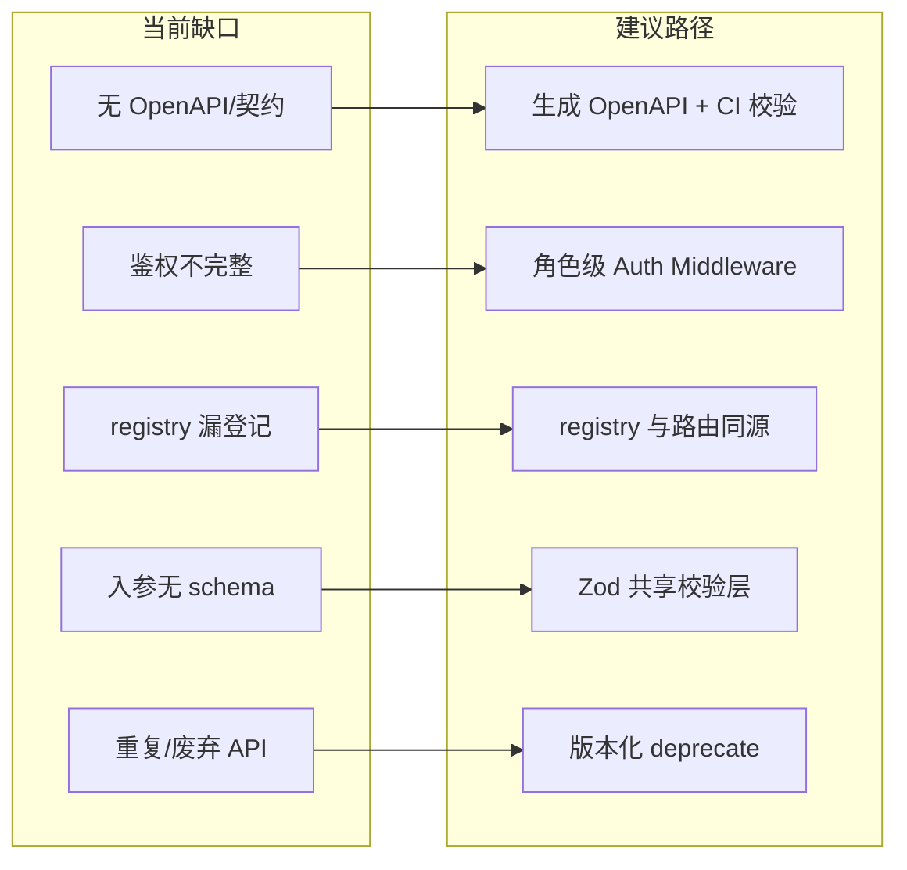

# Fitness Agent — Server API 参考与缺陷梳理

> **生成依据**：`server/src/index.ts` 挂载 + 各 `routes/` 源码 + `platform/monitoring/apiRegistry.ts`  
> **版本**：fitness-server 3.0.0 · stations async-only（coach | member | manager）  
> **读者**：前端、套壳、测试平台、后端维护者

---

## 0. 全局约定

### 0.1 基础信息

| 项 | 说明 |
|----|------|
| 协议 | HTTP/1.1 · JSON（SSE 除外） |
| 默认端口 | 见 `config.port`（本地通常 3000） |
| Content-Type | 请求体 `application/json`；SSE 响应 `text/event-stream` |
| Body 大小上限 | `2mb`（`express.json`） |

### 0.2 通用请求头

| Header | 必填 | 说明 |
|--------|------|------|
| `Content-Type: application/json` | POST/PUT/PATCH 有 body 时 | 标准 JSON 请求 |
| `X-Internal-Service-Key` 或 `Authorization: Bearer <key>` | **条件必填** | 见 §0.3；套壳生产 `DEPLOY_MODE=agentrun` 时对话 submit/stream 必带 |
| `Origin` | 浏览器跨域 | 须匹配 `CORS_ORIGIN` env |

### 0.3 鉴权模型（当前实现）

**无 JWT / Session Cookie**。信任模型分三层：

| 层 | 路径范围 | 机制 |
|----|----------|------|
| 公开探针 | `/`、`/health`、`/ready` | 无鉴权 |
| 内部 Pi tools | `/api/internal/*` | **不校验** Internal Key（依赖网络隔离；见 `pi-security.md`） |
| 套壳对话入口 | `*/turns/submit`、`*/turns/:id/stream` | 配置 `INTERNAL_API_KEY` 后，`internalApiKeyMiddleware` 校验 Key；**未配置则本地开发跳过** |
| 其余业务 CRUD | `/api/members`、`/api/sessions` 等 | **当前无鉴权** — 依赖前端/内网隔离 |

> 套壳详情见 [`pi-shell-integration.md`](pi-shell-integration.md)。

### 0.4 通用响应头

| Header | 条件 | 说明 |
|--------|------|------|
| `X-Trace-Id` | OTel 启用 | 当前 trace_id，便于关联 Jaeger（`traceResponseMiddleware`） |
| `Retry-After` | submit 503/429 | 队列满或限流时的建议等待秒数 |

### 0.5 错误响应格式

多数接口失败时返回：

```json
{ "error": "描述字符串" }
```

扩展字段（视场景）：

| 字段 | 场景 |
|------|------|
| `retry_after_sec` | 429 限流 / 503 队列满 / DB 熔断 |
| `circuit_breaker: true` | DB 熔断 |
| `queue_meta` | 队列策略（pending/processing/estimated_wait_sec） |
| `hint` | public_id 格式提示 |

HTTP 状态码惯例：`400` 参数缺失 · `403` 业务门禁/归属 · `404` 资源不存在 · `409` 冲突 · `429` 限流 · `503` 队列满/未就绪。

---

## 1. 探针与元信息

| 方法 | 路径 | 鉴权 | 入参 | 出参 | 说明 |
|------|------|------|------|------|------|
| GET | `/` | 无 | — | `{ name, version, architecture }` | 服务元信息 |
| GET | `/health` | 无 | — | `{ status, runtime, database, migrations }` | 存活探针；`status` 为 `ok`/`degraded` |
| GET | `/ready` | 无 | — | `{ ready: true }` 或 `503 { ready: false, reason }` | 就绪探针（预热完成后 200） |

---

## 2. 配置与引导

### GET `/api/llm/profiles`

| 项 | 内容 |
|----|------|
| 鉴权 | 无 |
| 入参 | 无 |
| 出参 | `{ profiles: LlmProfile[], default_profile_id, default_available }` |
| 用途 | 前端切换 LLM 场景 |

### GET `/api/bootstrap`

| 项 | 内容 |
|----|------|
| 鉴权 | 无 |
| Query | `coach_id`（可选；缺省取第一个 active 教练） |
| 出参 | `{ coaches, coach, members, llm, session, sessions, venues }` |
| 404 | 无 active 教练 / coach_id 不存在 |
| 用途 | 教练端首屏一次拉齐数据；自动 `ensure` 通用会话 |

### GET `/api/resolve/:publicId`

| 项 | 内容 |
|----|------|
| 鉴权 | 无 |
| Path | `publicId` — `mbr_xxx`（会员）或 `cch_xxx`（教练） |
| 出参 | 排障快照：实体信息、关联教练/会员、计划指针、最近会话与 interaction log |
| 400 | `invalid_public_id` |
| 404 | `not_found` |

---

## 3. 六站 Async 对话（三端共用模式）

三端路径前缀不同，**入参/出参结构相同**（角色字段不同）：

| 端 | 前缀 |
|----|------|
| 教练 | `/api/chat/turns` |
| 会员 | `/api/member/chat/turns` |
| 店长 | `/api/admin/chat/turns` |

以下用 `{prefix}` 表示。

### GET `{prefix}/config`

| 出参字段 | 说明 |
|----------|------|
| `role` | `coach` / `member` / `manager` |
| `mode` | 配置项 `coachTurn.mode` |
| `delivery` | 固定 `"sse"` |
| `poll_interval_ms` | 轮询间隔 |
| `stream_poll_ms` | SSE 服务端 tick |
| `worker_enabled` | Worker 是否启用 |

### POST `{prefix}/submit` ⚠️ 条件鉴权

**Body（JSON）**：

| 字段 | 教练 | 会员 | 店长 | 必填 |
|------|------|------|------|------|
| `session_id` | ✓ | ✓ | ✓ | **是** |
| `message` | ✓ | ✓ | ✓ | **是** |
| `client_turn_id` | ✓ | ✓ | ✓ | **是**（前端幂等 UUID） |
| `coach_id` | ✓ | — | — | 教练 **是** |
| `user_id` / `selected_user_id` | ✓ | — | — | 否（当前选定会员） |
| `member_id` | — | ✓ | — | 会员 **是** |
| `manager_id` | — | — | ✓ | 店长 **是** |
| `llm_profile` | ✓ | — | — | 否 |

**成功响应**：

| 状态 | Body |
|------|------|
| `202` | `{ turn_id, status: "pending", created: true, poll_interval_ms, queue_meta? }` |
| `200` | 幂等重试：`created: false`，返回已有 job 状态 |

**门禁拒绝**（S2 submit guard）：`400`/`403`/`404`/`429`/`503` + `{ error, retry_after_sec?, circuit_breaker? }`

**队列满**：`503` + `Retry-After` + `{ error, queue_meta: { pending, processing, retry_after_sec } }`

### POST `{prefix}/cancel`

> ⚠️ **未登记** `apiRegistry.ts`

| Body | 必填组合 |
|------|----------|
| `turn_id` | 单独即可 |
| 或 `session_id` + `client_turn_id` | 二者同时 |

| 响应 | 说明 |
|------|------|
| `200` | `{ cancelled: true, turn_id, status: "cancelled" }` |
| `409` | 非 pending 状态不可取消 |
| `400` | 参数不足 |

### GET `{prefix}/by-client/:sessionId/:clientTurnId`

| 行为 | `307` 重定向到 `{prefix}/:turnId` |
|------|-------------------------------------|
| 404 | turn 不存在 |

### GET `{prefix}/:turnId/stream` ⚠️ 条件鉴权

| 响应 | SSE 事件流 |
|------|------------|
| Content-Type | `text/event-stream` |
| 事件类型 | `status` · `thinking` · `trace` · `delta` · `final` · `error` · `done` |
| 终态 | `final` 含 Pi 回复（`response`、`message_type`、`form_data` 等）；`done` 结束连接 |

### GET `{prefix}/:turnId`

| Query | `after_seq`（可选，增量拉 stream_events） |
|-------|---------------------------------------------|
| 出参 | `{ turn_id, session_id, role, status, progress_phase, progress_label, stream_seq, stream_events, ... }` |
| completed | 合并 `result_json`（reply、message_type、form_data 等） |
| failed | `{ error, retryable: false }` |
| cancelled | `{ error }` |
| pending + 重试 | `{ next_retry_at, attempt_count }` |

---

## 4. 教练辅助

| 方法 | 路径 | 入参 | 出参 |
|------|------|------|------|
| GET | `/api/coach/info` | Query **`coach_id`** | 教练档案 + `public_id` |
| GET | `/api/coach/list` | — | `{ coaches: [...] }` active 列表 |
| POST | `/api/coach/switch-member` | Body **`coach_id`**；`user_id` 可选 | `{ ok: true }` — 写 Pi `CURRENT_MEMBER.md` |

---

## 5. 会员辅助

| 方法 | 路径 | 入参 | 出参 |
|------|------|------|------|
| GET | `/api/member/coaches` | — | `{ coaches: [...] }` |
| POST | `/api/member/switch-coach` | Body **`member_id`**；`coach_id` 可选 | `{ ok: true }` — 写 Pi `CURRENT_COACH.md` |

---

## 6. 聊天会话

| 方法 | 路径 | 入参 | 出参 / 状态 |
|------|------|------|-------------|
| POST | `/api/sessions/ensure` | Body **`coach_id`**；`user_id` 可选 | `{ session_id, coach_id, user_id, title, status, is_new }` |
| POST | `/api/sessions` | Body **`coach_id`**；`user_id`、`title` 可选 | 同上（强制新建，无锁去重） |
| GET | `/api/sessions` | Query **`coach_id`**；`user_id` 可选 | `{ sessions: [...] }` |
| GET | `/api/sessions/coach/:coachId/plan-status-notices` | Query `after_id`（默认 0） | `{ notices, max_id }` |
| GET | `/api/sessions/:sessionId/messages` | — | `{ messages: [{ id, role, content, message_type, form_data, experience_decision, routing_decision, ... }] }` |
| GET | `/api/sessions/:sessionId` | — | `{ session: {...} }` 含 active_member_* 字段 |
| PUT | `/api/sessions/:sessionId/member` | Body **`user_id`** | ⚠️ **@deprecated** — 请用 `ensure` 切换会员独立会话 |

---

## 7. 会员档案

| 方法 | 路径 | 入参 | 出参 |
|------|------|------|------|
| GET | `/api/members` | Query **`coach_id`** | `{ members: [{ user_id, public_id, nickname, gender, age, member_status }] }` |
| GET | `/api/members/search` | Query **`name`** + **`coach_id`** | `{ members, total }` |

---

## 8. 计划表单（plan_forms）

| 方法 | 路径 | 入参 | 出参 / 状态 |
|------|------|------|-------------|
| GET | `/api/plan-forms/id/:form_id` | — | 表单行或 404 |
| GET | `/api/plan-forms/:user_id` | Query `coach_id` 可选 | `{ exists: false }` 或 `{ exists: true, ... }` |
| POST | `/api/plan-forms` | Body **`user_id`, `coach_id`, `form_data`**；`session_id` 可选 | 201 新建 / 200 更新已有 |
| PUT | `/api/plan-forms/:form_id` | Body **`form_data`** | 更新后的表单 |
| DELETE | `/api/plan-forms/:form_id` | Query `coach_id`, `chat_session_id`（删除确认门禁） | `{ success: true }` |

---

## 9. 宏观训练计划（macro_plans）

| 方法 | 路径 | 入参 | 说明 |
|------|------|------|------|
| GET | `/api/training-plans/member-view/:user_id/:coach_id` | — | 会员端视图：pending/active/rejected + `awaiting_coach_submit` |
| GET | `/api/training-plans/snapshot/:coach_id/:user_id` | — | 五态快照 `{ active, draft, pending, rejected, ... }` |
| GET | `/api/training-plans/:user_id` | — | `{ plans: [...] }` 全历史 |
| GET | `/api/training-plans/detail/:plan_id` | — | 单条详情 |
| PUT | `/api/training-plans/detail/:plan_id` | Body **`plan_content`**, **`coach_id`**；`plan_name`, `goal` 可选 | 仅 Draft 可编辑 |
| POST | `/api/training-plans/detail/:plan_id/submit` | Body **`coach_id`** | Draft → Pending |
| POST | `/api/training-plans/detail/:plan_id/withdraw` | Body **`coach_id`** | Pending → Draft |
| POST | `/api/training-plans/detail/:plan_id/confirm` | Body **`user_id`** | 会员确认 Pending → Active |
| POST | `/api/training-plans/detail/:plan_id/reject` | Body **`user_id`**；`reason` 可选 | 会员拒绝 |
| POST | `/api/training-plans/detail/:plan_id/revise` | Body **`coach_id`** | Rejected → Draft |
| DELETE | `/api/training-plans/detail/:plan_id` | Query **`coach_id`**, `chat_session_id` | Draft/Rejected 丢弃；Active 归档 |
| PATCH | `/api/training-plans/:user_id/:coach_id/status` | Body `submitted_to_member` | ⚠️ **@deprecated** — 用 submit 替代 |
| PUT | `/api/training-plans/:user_id/:coach_id/content` | Body **`plan_content`** | 旧路径；按 snapshot 找 draft/active |

**计划 status 枚举**：`draft` · `pending` · `active` · `rejected` · `archived`

---

## 10. 课时（class_sessions）

| 方法 | 路径 | 入参 | 说明 |
|------|------|------|------|
| GET | `/api/class-sessions/venues` | — | `{ venues: [...] }` |
| GET | `/api/class-sessions/active` | Query **`user_id`** + **`coach_id`** | 进行中课时快照 |
| POST | `/api/class-sessions/commit` | Body **`user_id`, `coach_id`, `content`**；`session_id`, `venue`, `scheduled_time`, `plan_id` 可选 | Draft → Active；409 `active_session_exists` |
| PATCH | `/api/class-sessions/:sessionId` | Body **`content`**, **`coach_id`**；`venue` 可选 | 更新 Draft |
| PUT | `/api/class-sessions/:sessionId/complete` | Body **`summary`** | Active → Completed |
| DELETE | `/api/class-sessions/:sessionId` | Query `coach_id`, `user_id`, `chat_session_id` | 删 draft/active |
| GET | `/api/class-sessions/:sessionId` | — | `{ session: {...} }` |

**课时 status**：`draft` · `active` · `completed`

---

## 11. 审计与漫游

### GET `/api/logs`

| Query | `coach_id`, `user_id`, `session_id`, `limit`（默认 50）, `offset`（默认 0） |
|-------|-------------------------------------------------------------------------------|
| 出参 | `{ total, logs: [{ id, session_id, user_message, ai_response, intent, debug_log, ... }] }` |

### GET `/api/logs/:id`

单条完整日志（含 `debug_log` JSON）。

### GET `/api/journeys`

| Query | `session_id`, `status`, `limit`, `offset` |
|-------|-------------------------------------------|
| 出参 | 列表（运维排障） |

### GET `/api/journeys/:sessionId/:clientTurnId`

单条消息六站漫游（`turn_journeys` 表 JSONB）。

---

## 12. Internal API（Pi Tools · 无 UI）

> 挂载前缀 `/api/internal`。当前**不校验** Internal Key，依赖部署网络隔离。

### 12.1 教练侧只读

| 方法 | 路径 | 入参 | 出参 |
|------|------|------|------|
| GET | `/coach/:coachId/members/search` | Query `name` | `{ found, count, members }` |
| GET | `/coach/:coachId/member/:userId` | — | 会员档案 + `assessment_items` |
| GET | `/coach/:coachId/member/:userId/training-plan` | — | 五态 snapshot |
| GET | `/coach/:coachId/member/:userId/plan-form` | — | 最新 plan_form |
| GET | `/coach/:coachId/member/:userId/active-session` | — | 进行中课时 |
| GET | `/coach/:coachId/session/:sessionId` | — | 课时详情 |

### 12.2 店长侧

| 方法 | 路径 | 入参 | 出参 |
|------|------|------|------|
| GET | `/admin/:managerId/coaches` | — | `{ coaches }` |
| GET | `/admin/:managerId/members` | Query `coachId` 可选 | `{ members }` |
| GET | `/admin/:managerId/coaches/:coachId/performance` | — | 业绩统计 |
| GET | `/admin/:managerId/members/:memberId/progress` | — | 档案 + 最近课时 |
| POST | `/admin/:managerId/assign-member` | Body **`memberId`, `coachId`** | `{ ok: true }` |
| GET | `/admin/:managerId/report` | Query `startDate`, `endDate` | 周期报表 |

### 12.3 记忆睡梦

| 方法 | 路径 | 说明 |
|------|------|------|
| POST | `/memory-dream/enqueue-batch` | ⚠️ **未登记** apiRegistry；批量入队 dream job |

### 12.4 知识库只读

| 方法 | 路径 | 入参 | 出参 |
|------|------|------|------|
| GET | `/knowledge/schema` | — | `{ content }` AGENTS 编译契约 |
| GET | `/knowledge/search` | Query `q`；`limit` 可选 | `{ query, hits }` |
| GET | `/knowledge/index` | — | `{ content }` wiki/index.md |
| GET | `/knowledge/page/*` | Path 相对 wiki/ | `{ ok, content }` 或 404 |
| GET | `/knowledge/raw/list` | — | `{ sources }` |
| GET | `/knowledge/raw/*` | Path 相对 raw/ | 源文件内容 |

---

## 13. 接口总览（按分组统计）

| 分组 | 数量 | 前缀 |
|------|------|------|
| 探针 | 3 | `/`, `/health`, `/ready` |
| 配置引导 | 3 | `/api/llm`, `/api/bootstrap`, `/api/resolve` |
| Async 对话 ×3 端 | 6×3=18 | `*/turns/*`（含 cancel） |
| 教练/会员辅助 | 5 | `/api/coach`, `/api/member` |
| 会话 | 7 | `/api/sessions` |
| 会员档案 | 2 | `/api/members` |
| 计划表单 | 5 | `/api/plan-forms` |
| 训练计划 | 13 | `/api/training-plans` |
| 课时 | 7 | `/api/class-sessions` |
| 审计漫游 | 4 | `/api/logs`, `/api/journeys` |
| Internal Pi | 18 | `/api/internal` |
| **合计** | **~85** | — |

---

## 14. Server 层接口缺陷与弥补建议

### 14.1 缺陷总览



### 14.2 缺陷明细

| # | 缺陷 | 现状 / 风险 | 弥补建议 | 优先级 |
|---|------|-------------|----------|--------|
| 1 | **无机器可读 API 契约** | 无 OpenAPI/Swagger；前后端靠读 TS 源码对齐 | 从路由 + Zod schema 生成 `openapi.yaml`；CI 对比 `apiRegistry` 防漂移 | P0 |
| 2 | **业务 CRUD 无鉴权** | `/api/members`、`/api/sessions`、`/api/training-plans` 等对外裸奔 | 按三端加 JWT/Session 中间件；或 AgentRun 网关统一鉴权后再转发 BFF | P0 |
| 3 | **Internal API 无 Key 校验** | `/api/internal/*` 仅依赖网络隔离 | 生产强制 mTLS 或 `X-Internal-Service-Key`；与 submit 共用 Key 或独立 `PI_TOOLS_KEY` | P0 |
| 4 | **apiRegistry 不完整** | 缺 `POST */turns/cancel`、`POST /api/internal/memory-dream/enqueue-batch`；日志出现「未登记接口」 | 新增路由时 **同 PR** 更新 `apiRegistry.ts`；脚本扫描 `router.(get\|post...)` 与 registry diff | P1 |
| 5 | **入参校验分散** | 各 handler 手写 `if (!x)`；类型不一致（`coach_id` 有时 string 有时 number） | 引入 `@asteasolutions/zod-express-middleware` 或自研 `validateBody/query`；ID 统一 `coerceEntityId` | P1 |
| 6 | **错误响应不统一** | 混用 `'Internal server error'` / `'Failed to list members'` / 裸 `{ error }` | 定义 `ApiError` 类 + `globalErrorMiddleware` 输出 `{ error, code?, details? }` | P1 |
| 7 | **废弃 API 仍挂载** | `PUT /sessions/:id/member`、`PATCH /training-plans/.../status` 标记 deprecated 但未下线 | 响应头加 `Deprecation: true` + `Sunset`；前端迁移完成后删除 | P2 |
| 8 | **Public vs Internal 会员搜索重复** | `/api/members/search` 与 `/api/internal/coach/.../members/search` 逻辑近似 | Internal 保持 Pi 专用；Public 加鉴权；长期合并为单一 service 函数 | P2 |
| 9 | **运维接口无保护** | `/api/logs`、`/api/journeys`、`/api/resolve` 任意访问可泄露 debug_log / journey | 限制内网 IP 或 Admin Token；生产默认关闭 `/api/resolve` | P1 |
| 10 | **DELETE 门禁参数不一致** | plan/training/class 删除需 `coach_id` + `chat_session_id` 查 delete_confirm 状态 | 文档化 + 前端统一传参；考虑 Header `X-Chat-Session-Id` | P2 |
| 11 | **无请求 ID 关联** | 仅 OTel 启用时有 `X-Trace-Id` | 未启用 OTel 时也生成 `X-Request-Id`（`requestLogContextMiddleware` 已有 trace，可暴露给客户端） | P2 |
| 12 | **SSE 无标准错误码** | stream 失败可能只写 SSE error 事件 | 文档约定 + 客户端 fallback 到 poll `GET /:turnId` | P2 |
| 13 | **console.warn 泄漏** | `trainingPlans.ts` confirm/reject 用 `console.warn` 而非 `log.*` | 改为 `log.warn` + `LogEvent` | P3 |
| 14 | **无 API 版本前缀** | 全部 `/api/...` 无 `v1` | 大改前引入 `/api/v1`；旧路径保留 redirect 一个版本周期 | P3 |
| 15 | **缺少集成测试覆盖表** | 85+ 端点，E2E 仅覆盖主链 | 按 `apiRegistry` 生成 smoke test 矩阵（参数校验 + 401/404 快照） | P2 |

### 14.3 推荐实施顺序

**第一阶段（1–2 周）— 可观测 + 登记**

1. 补全 `apiRegistry.ts` 遗漏端点（cancel、memory-dream）
2. 添加 `scripts/api-registry-check.mjs`：路由扫描 vs registry CI gate
3. 运维接口加 IP 白名单或 `ADMIN_API_KEY`（进 `appSettings.ts`）

**第二阶段（2–4 周）— 契约 + 校验**

1. 选 5 个高频接口（submit、ensure、bootstrap、messages、training-plans/detail）写 Zod schema
2. 生成 OpenAPI 3.1 → 前端/测试平台导入
3. 统一 `ApiError` 响应格式

**第三阶段（1–2 月）— 安全**

1. 三端 JWT（或套壳网关鉴权 + BFF 信任 `X-User-Role`/`X-Actor-Id`）
2. Internal API 强制 Key + 仅 bind localhost / 内网 Service Mesh
3. 废弃 API 下线计划

### 14.4 与现有文档的衔接

| 主题 | 文档 |
|------|------|
| 鉴权 / 套壳 | [`pi-shell-integration.md`](pi-shell-integration.md) |
| 可观测 / journey | [`pi-observability.md`](pi-observability.md) |
| 配置开关 | [`pi-config.md`](pi-config.md) · `appSettings.ts` |
| 安全边界 | [`pi-security.md`](pi-security.md) |
| 路由代码地图 | [`server/src/platform/routes/README.md`](../server/src/platform/routes/README.md) |
| apiRegistry 维护 | [`server/src/platform/monitoring/apiRegistry.ts`](../server/src/platform/monitoring/apiRegistry.ts) |

---

## 15. 附录：Async Submit 门禁速查

| 拒绝原因 | HTTP | error 示例 |
|----------|------|------------|
| 空消息 / 超长 | 400 | `message required` / `message exceeds N characters` |
| 缺 session_id 等 | 400 | `session_id, message, client_turn_id required` |
| session 不存在 | 404 | `session not found` |
| session 归属不符 | 403 | `session does not belong to coach` |
| 重复相同内容 | 429 | `请勿重复发送相同内容` |
| 上一条仍在处理 | 429 | `上一条仍在处理，请稍候` |
| 发送过快 | 429 | `发送过快，请稍后再试` |
| DB 熔断 | 503 | `数据库繁忙，请稍后再试` |
| 队列满 | 503 | queue_meta + Retry-After |

配置阈值见 `APP_SETTINGS.turnSubmit` → [`pi-config.md`](pi-config.md)。

---

*文档随代码变更需同步更新；新增 HTTP 路由请同时修改 `apiRegistry.ts` 与本文件对应章节。*
